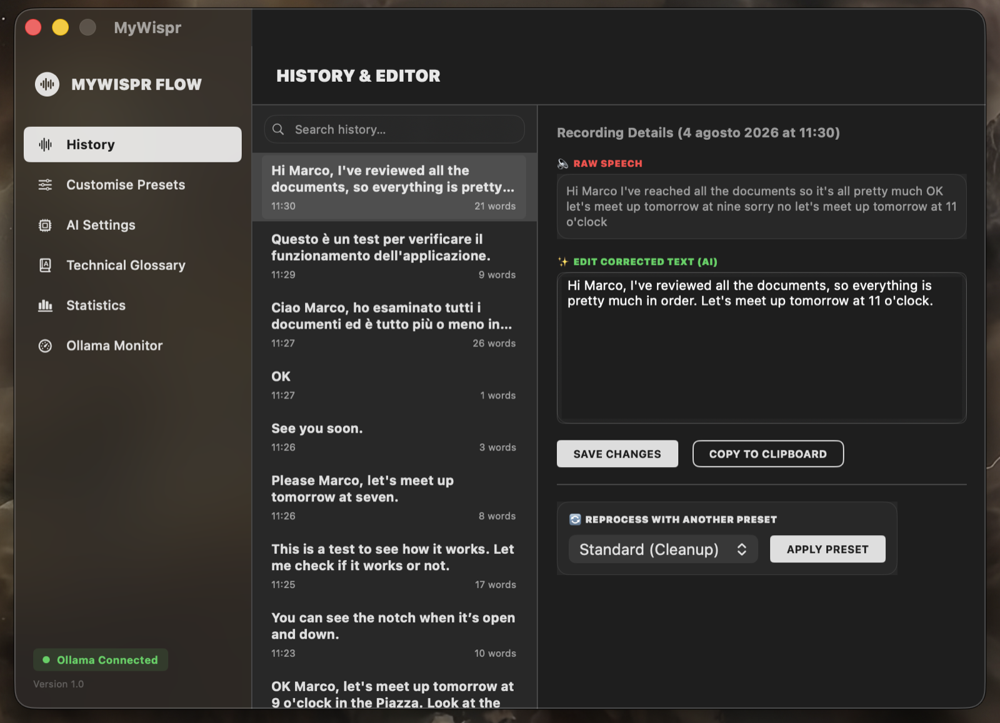

<div align="center">

# MyWispr 🎙️✨

**Native macOS voice dictation with local AI cleanup.**
Hold a key, speak, release — your words land in any text field, already corrected and formatted.

[](https://www.apple.com/macos/)
[](https://support.apple.com/en-us/HT211814)
[](https://swift.org)
[](LICENSE)

[English](#english) · [Italiano](#italiano)

</div>

> [!TIP]
> **MyWispr is fully bilingual — Italian and English.** One picker in
> *Dashboard → AI Settings → Language* switches the recognition locale, the AI prompts,
> the default glossary and the entire interface. No relaunch needed.

---

## Screenshots



*The History tab in dark mode. On the right, what was actually said next to what
MyWispr pasted:* **"…let's meet tomorrow at nine, actually no sorry, let's make it eleven"**
*became* **"Let's meet tomorrow at 11."** *— the hesitation removed and the correction
resolved, not merely transcribed.*


*Hovering the resting notch expands it: the active preset, a live Ollama
connection indicator, and one tap to switch between cleanup, formal, bullet list,
translation and prompt builder — without opening the dashboard.*

<!-- The demo video is uploaded through the GitHub editor rather than committed:
     a .mov in the repository would sit in the git history permanently. Edit this
     file on github.com, drag the video into the editor, and paste the resulting
     link below this comment. -->

https://github.com/user-attachments/assets/9dc041ae-19fa-4d45-ac98-94d6e4b4e8d5

---: | :---: |
| _`docs/overlay-recording.png`_ | _`docs/dashboard-history.png`_ |

---

## English

MyWispr is a lightweight native macOS app written in Swift. It uses Apple's speech
recognition to transcribe what you say and a **local LLM through [Ollama](https://ollama.com)**
to clean it up — removing filler words, fixing grammar, resolving mid-sentence
corrections — then pastes the result into whatever app has focus.

The UI is a floating capsule inspired by Apple's Dynamic Island: a real
`.ultraThinMaterial` glass overlay that shows the audio equaliser and live
transcript while you talk, and expands on hover for quick preset switching.

### Privacy — what actually happens to your data

This is the part most dictation tools are vague about, so here it is precisely:

| Stage | Where it runs | Leaves your Mac? |
| :--- | :--- | :--- |
| **Audio capture** | Local (`AVAudioEngine`) | No |
| **Speech-to-text** | Apple `SFSpeechRecognizer` | **Only if the on-device model is unavailable** — see below |
| **AI cleanup** | Ollama on `127.0.0.1:11434` | No |
| **Paste** | Local (`NSPasteboard` + synthetic Cmd+V) | No |
| **History** | Local (`UserDefaults`) | No |

MyWispr requests **on-device speech recognition** whenever macOS reports it is
available for your locale, so no audio is sent anywhere. If the offline language
model is not installed, `SFSpeechRecognizer` falls back to Apple's servers — and
in that case the app tells you so, in **Dashboard → AI Settings → Privacy &
Diagnostics**, with a link to where you can install the offline language.

The AI cleanup stage is unconditionally local: every request goes to
`127.0.0.1` and nothing else.

**Logging.** MyWispr keeps a diagnostic log at
`~/Library/Logs/MyWispr/mywispr.log`. By default it records only the *length* of
what you dictated, never the content — dictated text can contain passwords and
private messages. You can opt into full logging from the Privacy panel when you
need to debug something. The log rotates at 1 MB.

### Features

**Bilingual (Italian / English)**
- A single picker switches the `SFSpeechRecognizer` locale, the AI prompt set, the default glossary and every interface string, live.
- The prompts are not translations of one another: each set is tuned for how dictation actually fails in that language. The Italian set fixes English technical terms mangled phonetically (`gittab` → GitHub); the English set fixes homophones (`there going to send they're report` → *They're going to send their report*).
- The *Translation* preset is directional — it always targets the other language, so it stays useful in both modes.
- The picker is disabled mid-recording: swapping the recogniser under a live audio tap is not safe.

**Light, dark and Apple materials**
- The whole interface is built from macOS semantic colours and SwiftUI `Material`, so it follows the system appearance — plus a System / Light / Dark picker in *AI Settings* if you want to override it.
- Panels are translucent material with continuous-curvature corners and hairline edges; the sidebar uses real `NSVisualEffectView` vibrancy, matching the overlay's glass.
- The monochrome accent inverts rather than flattening: black-on-white becomes white-on-black.

**No time limit**
- Speak for as long as you like. A single `SFSpeechRecognitionTask` will not run indefinitely, so MyWispr swaps in a fresh one every 50 seconds and carries the text across — the microphone is never interrupted and nothing said is dropped.
- Pauses are handled the same way: the recogniser silently starts a new utterance after a pause, and the text from before it is preserved rather than overwritten.

**Two dictation modes**
- **Hold-to-talk** — hold the hotkey (default: Right Option), speak, release. Transcribed, cleaned, pasted.
- **Lock-to-listen** — press the hotkey twice quickly for hands-free continuous dictation. Each pause is transcribed, cleaned, pasted, and the mic restarts automatically. Exit with the hotkey or any left click.
- **Accidental-tap guard** — a press under 0.25s with nothing said is cancelled silently, with no paste and no AI call.

**Dynamic Island-style overlay**
- Real glassmorphism via native `.ultraThinMaterial`, clipped to a capsule.
- Idle: a thin resting line. Recording: an audio equaliser, or the live transcript as it streams in. Processing: an AI activity indicator.
- Hover to expand and switch AI presets without opening the dashboard.
- Clicks in the transparent padding pass through to the app underneath.

**Local AI presets**
- *Standard* — faithful cleanup: grammar, filler words, self-corrections.
- *Formal / Email* — rewrites for professional contexts.
- *Bullet list* — turns speech into structured action items.
- *Translation* — directional: Italian in → idiomatic English out, or English in → idiomatic Italian out, following the language picker.
- *Prompt builder* — expands a spoken idea into a structured AI prompt.
- *Custom* — your own instructions, saved as reusable named presets: create, edit and activate them from the Presets tab, or switch straight from the notch using the icon you gave each one. Editing the preset in use takes effect on the next dictation.
- The app checks whether the model is already resident in RAM/VRAM and shows "Starting AI model…" while it warms up, instead of appearing frozen.
- If Ollama is unreachable, you get a visible warning and the **raw transcript is still pasted** — a dictation is never lost.

**Text handling**
- **Glossary** — substitution rules applied before the AI runs, for names, acronyms and technical terms your dictation consistently gets wrong.
- **History & diff viewer** — every transcription, with the raw and cleaned text side by side and changes highlighted. Re-run any entry through a different preset.
- **Analytics** — words dictated, estimated time saved, daily chart.

**Onboarding**
- Guided setup for the three required permissions (Microphone, Speech Recognition, Accessibility), linking straight to the right System Settings pane rather than triggering the macOS permission popup that can loop forever.

### Requirements

- macOS 13.0 Ventura or later
- Apple Silicon (M1 or newer)
- Xcode Command Line Tools
- [Ollama](https://ollama.com) with at least one model pulled

> [!NOTE]
> **Model capability matters.** The prompts are tuned and regression-tested against
> `qwen2.5:14b`, where they score 30/30 on a suite covering normal dictation plus
> edge cases. On a very small model (`llama3.2:1b`) the same suite scores 18/30 and
> the instruction-injection defence stops holding. Prefer 7b or larger.

### Installation

```bash
# 1. Xcode Command Line Tools
xcode-select --install

# 2. Ollama, plus a model
#    Install from https://ollama.com, then:
ollama pull qwen2.5:14b        # or qwen2.5:7b / qwen2.5:3b on less RAM

# 3. Clone and build
git clone https://github.com/attilio-ap/mywispr.git
cd mywispr
./build.sh                     # builds, ad-hoc signs, installs to /Applications
#./build.sh --no-install       # or keep MyWispr.app in the project folder

# 4. Run
open /Applications/MyWispr.app
```

`build.sh` ad-hoc signs the bundle. This matters: macOS ties the Accessibility
permission to the code signature, so an unsigned build would lose its permission
on every rebuild.

The app is **not notarized**. On first launch macOS may refuse to open it —
right-click the app → *Open*, or allow it under *System Settings → Privacy &
Security*.

### Permissions

MyWispr needs three, and the onboarding screen walks you through each:

| Permission | Why |
| :--- | :--- |
| **Microphone** | Capture audio |
| **Speech Recognition** | Transcribe it |
| **Accessibility** | Global hotkey (`CGEventTap`) and synthetic Cmd+V to paste |

> If the hotkey doesn't respond even though the Accessibility toggle looks
> enabled, switch it off and on again. macOS caches TCC decisions per code
> signature and this forces a refresh — it is the usual fix after a rebuild.

### Adding a third language

Localization lives in [`Localization.swift`](Localization.swift) as a plain Swift table rather
than `.strings` files. That is deliberate: `NSLocalizedString` resolves against the bundle
language at launch, so an in-app toggle would need bundle swizzling, whereas a struct rebuilt
from an `@Published` property re-renders every SwiftUI view for free — and a missing string is
a compile error instead of a silent fallback.

To add a language:

1. Add a case to `AppLanguage`, with its `recognitionLocale` and `defaultGlossary`.
2. Fix the compile errors in `L10n` — the compiler points at every string that needs a translation.
3. Add a prompt set in [`OllamaManager.swift`](OllamaManager.swift) (`italianPrompt` / `englishPrompt`), tuned for that language's dictation failure modes rather than translated.
4. Add a `Resources/<code>.lproj/InfoPlist.strings` and list the code in `CFBundleLocalizations`.

The `t(_:_:)` helper takes one argument per language, so step 2 is exhaustive by construction.

### Tests

```bash
./run-tests.sh              # every suite
./run-tests.sh Analytics    # one suite
```

| Suite | Covers |
| :--- | :--- |
| `DictationStateMachine` | Hold-to-talk and lock-to-listen: double-press detection, accidental taps, exits, stale events, timing boundaries |
| `TranscriptAccumulator` | Text surviving the recogniser restarts that happen every time you pause |
| `Analytics` | Word counting across line breaks, totals following history edits, glossary substitution |
| `CustomPresets` | Activation by reference, editing the preset in use, deletion leaving nothing dangling, legacy fallback |
| `OutputCleanup` | Stripping the empty scaffolding sections models add to prompt-builder output |
| `Prompts` | All six presets in both languages against a live model — normal dictation plus instruction injection, dictated questions, numbers, mangled technical terms |

`Prompts` drives the real `OllamaManager`, so the prompts under test are the ones
that ship — there is no second copy to drift. It skips rather than fails when
Ollama is not running, and takes `MW_MODEL` / `MW_PRESET` / `MW_LANG` to narrow a run.

### Architecture

| File | Responsibility |
| :--- | :--- |
| [`main.swift`](main.swift) | `AppDelegate`, window setup, and performing the state machine's decisions |
| [`DictationStateMachine.swift`](DictationStateMachine.swift) | Hold-to-talk / lock-to-listen logic, free of AppKit so it can be tested |
| [`AppState.swift`](AppState.swift) | Observable shared state and persistence |
| [`Localization.swift`](Localization.swift) | `AppLanguage` + the full Italian/English string table |
| [`Theme.swift`](Theme.swift) | Colour/material design tokens, glass panel modifiers, appearance switching |
| [`KeyboardManager.swift`](KeyboardManager.swift) | Global hotkey via `CGEventTap` on a dedicated thread |
| [`SpeechManager.swift`](SpeechManager.swift) | Audio capture and `SFSpeechRecognizer` session handling |
| [`OllamaManager.swift`](OllamaManager.swift) | Local Ollama client and prompt construction |
| [`PasteManager.swift`](PasteManager.swift) | Clipboard-preserving paste via synthetic Cmd+V |
| [`OverlayWindow.swift`](OverlayWindow.swift) | The floating capsule panel and its SwiftUI view |
| [`DashboardView.swift`](DashboardView.swift) | Six-tab settings and history dashboard |
| [`Logger.swift`](Logger.swift) | Privacy-aware rotating file logger |

### Known limitations

- Apple Silicon only; no Intel build target.
- The macOS permission prompts follow the **system** language, not the in-app picker — macOS reads them from the bundle before the app runs.
- Not notarized — Gatekeeper will warn on first launch.
- Pasting uses a synthetic Cmd+V, so it will not work in apps that ignore the standard paste shortcut.

### License

MIT — see [LICENSE](LICENSE).

---

## Italiano

MyWispr è un'applicazione macOS nativa e leggera, scritta in Swift. Usa il
riconoscimento vocale di Apple per trascrivere quello che dici e un **LLM locale
tramite [Ollama](https://ollama.com)** per ripulirlo — rimuovendo intercalari,
correggendo la grammatica, risolvendo i ripensamenti a metà frase — e incolla il
risultato nell'app che ha il focus.

L'interfaccia è una capsula fluttuante ispirata alla Dynamic Island di Apple:
un overlay in vero vetro `.ultraThinMaterial` che mostra l'equalizzatore audio e
la trascrizione in tempo reale mentre parli, e si espande al passaggio del mouse
per cambiare preset al volo.

### Privacy — cosa succede davvero ai tuoi dati

| Fase | Dove viene eseguita | Esce dal Mac? |
| :--- | :--- | :--- |
| **Cattura audio** | Locale (`AVAudioEngine`) | No |
| **Trascrizione** | Apple `SFSpeechRecognizer` | **Solo se il modello on-device non è disponibile** |
| **Elaborazione AI** | Ollama su `127.0.0.1:11434` | No |
| **Incolla** | Locale (`NSPasteboard` + Cmd+V sintetico) | No |
| **Cronologia** | Locale (`UserDefaults`) | No |

MyWispr richiede il **riconoscimento vocale on-device** ogni volta che macOS lo
segnala disponibile per la tua lingua: in quel caso nessun audio lascia il Mac.
Se il modello offline non è installato, `SFSpeechRecognizer` ricade sui server
Apple — e in quel caso l'app te lo dice esplicitamente, in **Dashboard →
Impostazioni AI → Privacy e Diagnostica**.

L'elaborazione AI è sempre e solo locale: ogni richiesta va a `127.0.0.1`.

**Log.** MyWispr scrive un log diagnostico in
`~/Library/Logs/MyWispr/mywispr.log`. Per impostazione predefinita registra solo
la *lunghezza* del testo dettato, mai il contenuto: quello che detti può
contenere password e messaggi privati. Puoi attivare il log completo dal pannello
Privacy quando serve fare diagnosi. Il file ruota a 1 MB.

### Funzionalità

**Bilingue (italiano / inglese)**
- Un unico selettore cambia il locale di `SFSpeechRecognizer`, i prompt AI, il glossario predefinito e tutti i testi dell'interfaccia, in tempo reale.
- I prompt non sono la traduzione l'uno dell'altro: ogni set è tarato su come la dettatura sbaglia davvero in quella lingua.
- Il preset *Traduzione* è direzionale: punta sempre all'altra lingua, quindi resta utile in entrambe le modalità.
- Il selettore è disabilitato durante la registrazione: cambiare recognizer con un tap audio attivo non è sicuro.

**Chiaro, scuro e materiali Apple**
- Tutta l'interfaccia usa colori semantici di macOS e `Material` di SwiftUI, quindi segue l'aspetto di sistema — con in più un selettore Sistema / Chiaro / Scuro in *Impostazioni AI*.
- I pannelli sono materiale traslucido con angoli a curvatura continua e bordi sottilissimi; la barra laterale usa la vera vibrancy di `NSVisualEffectView`, in linea col vetro della notch.
- L'accento monocromatico si inverte invece di appiattirsi: nero-su-bianco diventa bianco-su-nero.

**Nessun limite di tempo**
- Parla quanto vuoi. Un singolo `SFSpeechRecognitionTask` non gira all'infinito, quindi MyWispr ne avvia uno nuovo ogni 50 secondi portandosi dietro il testo: il microfono non si interrompe mai e nulla di ciò che hai detto va perso.
- Le pause sono gestite allo stesso modo: dopo una pausa il riconoscitore ricomincia in silenzio una nuova frase, e il testo precedente viene conservato invece che sovrascritto.

**Due modalità di dettatura**
- **Hold-to-talk** — tieni premuto l'hotkey (default: Opzione Destra), parla, rilascia.
- **Lock-to-listen** — premi due volte rapidamente per la dettatura continua a mani libere. Ogni pausa viene trascritta, ripulita e incollata, e il microfono riparte da solo. Esci con l'hotkey o con un click sinistro.
- **Protezione dai click accidentali** — una pressione sotto i 0.25s senza parlato viene annullata senza incollare nulla né chiamare l'AI.

**Overlay stile Dynamic Island**
- Vero glassmorphism con `.ultraThinMaterial` nativo, sagomato a capsula.
- A riposo: una linea sottile. In registrazione: equalizzatore audio o trascrizione in streaming. In elaborazione: indicatore di attività AI.
- Passa il mouse sopra per espanderla e cambiare preset senza aprire la dashboard.
- I click nel padding trasparente passano all'app sottostante.

**Preset AI locali**
- *Standard* — correzione fedele: grammatica, intercalari, autocorrezioni.
- *Formale / Email* — riscrittura per contesti professionali.
- *Elenco puntato* — trasforma il parlato in punti orientati all'azione.
- *Traduzione* — direzionale: dall'italiano a un inglese idiomatico, o viceversa, seguendo il selettore di lingua.
- *Generatore di prompt* — espande un'idea dettata in un prompt AI strutturato.
- *Personalizzato* — le tue istruzioni, salvate come preset con un nome: creali, modificali e attivali dal tab Preset, oppure cambiali al volo dalla notch con l'icona che hai scelto. Modificare il preset in uso ha effetto dalla dettatura successiva.
- L'app verifica se il modello è già in RAM/VRAM e mostra "Avvio modello AI…" durante il caricamento, invece di sembrare bloccata.
- Se Ollama non è raggiungibile ricevi un avviso e **viene comunque incollata la trascrizione grezza**: una dettatura non si perde mai.

**Gestione del testo**
- **Glossario** — regole di sostituzione applicate prima dell'AI, per nomi propri, acronimi e termini tecnici che la trascrizione sbaglia sistematicamente.
- **Cronologia e diff viewer** — ogni trascrizione, con testo grezzo e ripulito a confronto e le modifiche evidenziate. Puoi ri-elaborare qualsiasi voce con un preset diverso.
- **Analytics** — parole dettate, tempo stimato risparmiato, grafico giornaliero.

**Onboarding**
- Guida ai tre permessi richiesti (Microfono, Riconoscimento Vocale, Accessibilità), con link diretti al pannello corretto delle Impostazioni di Sistema, evitando il popup di macOS che può entrare in loop.

### Requisiti

- macOS 13.0 Ventura o superiore
- Apple Silicon (M1 o successivo)
- Xcode Command Line Tools
- [Ollama](https://ollama.com) con almeno un modello scaricato

> [!NOTE]
> **La capacità del modello conta.** I prompt sono tarati e testati contro
> `qwen2.5:14b`, dove ottengono 30/30 su una suite che copre dettatura normale e
> casi limite. Su un modello molto piccolo (`llama3.2:1b`) la stessa suite fa 18/30
> e la difesa contro l'iniezione di istruzioni non regge più. Meglio 7b o superiore.

### Installazione

```bash
# 1. Xcode Command Line Tools
xcode-select --install

# 2. Ollama e un modello
#    Installa da https://ollama.com, poi:
ollama pull qwen2.5:14b        # oppure qwen2.5:7b / qwen2.5:3b con meno RAM

# 3. Clona e compila
git clone https://github.com/attilio-ap/mywispr.git
cd mywispr
./build.sh                     # compila, firma ad-hoc, installa in /Applications
#./build.sh --no-install       # oppure lascia MyWispr.app nella cartella del progetto

# 4. Avvia
open /Applications/MyWispr.app
```

`build.sh` firma il bundle ad-hoc: macOS lega il permesso di Accessibilità alla
firma del codice, quindi senza firma il permesso andrebbe perso a ogni ricompilazione.

L'app **non è notarizzata**. Al primo avvio macOS potrebbe rifiutarsi di aprirla:
click destro sull'app → *Apri*, oppure autorizzala in *Impostazioni di Sistema →
Privacy e Sicurezza*.

### Permessi

| Permesso | Perché serve |
| :--- | :--- |
| **Microfono** | Catturare l'audio |
| **Riconoscimento Vocale** | Trascriverlo |
| **Accessibilità** | Hotkey globale (`CGEventTap`) e Cmd+V sintetico per incollare |

> Se l'hotkey non risponde nonostante il toggle di Accessibilità sia attivo,
> disattivalo e riattivalo. macOS mantiene in cache le decisioni TCC per firma
> del codice: questo forza l'aggiornamento ed è il rimedio abituale dopo una
> ricompilazione.

### Test

```bash
./run-tests.sh              # tutte le suite
./run-tests.sh Analytics    # una sola
```

| Suite | Copre |
| :--- | :--- |
| `DictationStateMachine` | Hold-to-talk e lock-to-listen: doppia pressione, tap accidentali, uscite, eventi obsoleti, soglie temporali |
| `TranscriptAccumulator` | Il testo che sopravvive ai riavvii del riconoscitore a ogni pausa |
| `Analytics` | Conteggio parole a capo, totali che seguono le modifiche allo storico, glossario |
| `CustomPresets` | Attivazione per riferimento, modifica del preset in uso, cancellazione senza riferimenti pendenti, compatibilità col vecchio prompt |
| `OutputCleanup` | Rimozione delle sezioni vuote che i modelli aggiungono all'output del generatore di prompt |
| `Prompts` | I sei preset in entrambe le lingue su un modello reale — dettatura normale più iniezione di istruzioni, domande dettate, numeri, termini tecnici storpiati |

`Prompts` usa il vero `OllamaManager`, quindi testa esattamente i prompt che vengono
spediti. Salta invece di fallire se Ollama non è in esecuzione.

### Limitazioni note

- Solo Apple Silicon, nessun target Intel.
- Le richieste di permesso di macOS seguono la lingua di **sistema**, non il selettore interno: macOS le legge dal bundle prima che l'app parta.
- Non notarizzata: Gatekeeper avvisa al primo avvio.
- L'incolla usa un Cmd+V sintetico, quindi non funziona nelle app che ignorano la scorciatoia standard.

### Licenza

MIT — vedi [LICENSE](LICENSE).
